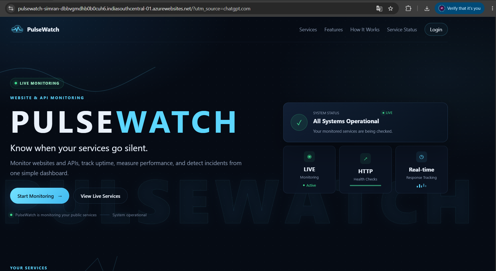
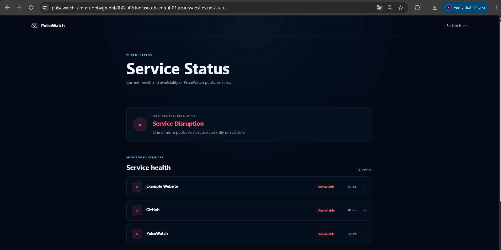
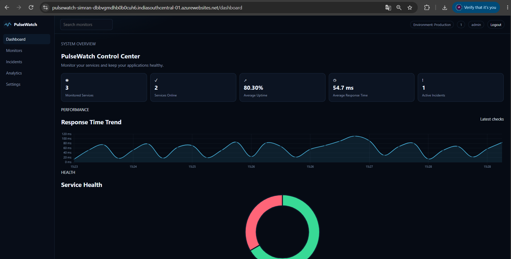
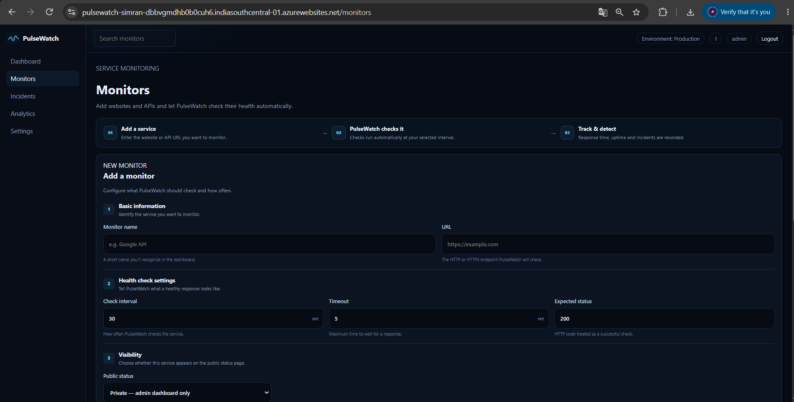
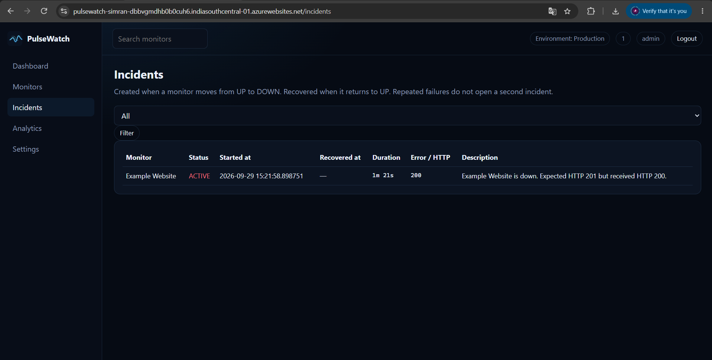
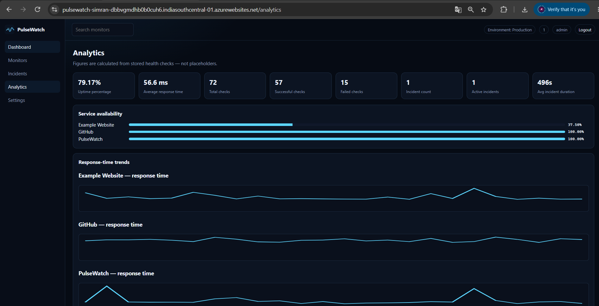

# PulseWatch

[](https://github.com/Simran24MCC20089/pulsewatch/actions/workflows/ci.yml)

**Know when your services go silent.**

PulseWatch is a small, real website and API monitoring service. An administrator configures public HTTP/HTTPS endpoints. A backend engine performs live health checks, stores history, opens and recovers incidents, calculates uptime, and publishes a client-facing status page.

**Monitor → Detect → Analyze → Inform**

## 1. Project Overview

PulseWatch is a Flask application with a public landing page, a public service status experience, and a protected admin control center. There is a single administrator account. Clients do not sign up.

## 2. Problem Statement

Services fail quietly. Teams need a simple way to watch public URLs, notice when they stop answering correctly, and share an honest status page with people who depend on those services.

## 3. Product Purpose

PulseWatch continuously checks configured websites and APIs, records availability and response time, detects incidents, and exposes safe health information to clients.

## 4. Client + Admin Architecture

| Side | Who | Access |
| --- | --- | --- |
| Public client | Anyone | `/`, `/status`, `/status/service/<id>`, `/api/public/status`, `/health` |
| Admin / operator | Single owner | `/login` then `/dashboard`, `/monitors`, `/incidents`, `/analytics`, `/settings` |

There is no multi-user auth, no OAuth, and no client signup. Credentials live in environment variables as a username plus a password hash.

### Deployment and Monitoring Flow

```text
Developer/Admin
      ↓
   GitHub
      ↓
GitHub Actions
      ↓
    Tests
      ↓
 Docker Build
      ↓
  Docker Hub
      ↓
    Azure
      ↓
PulseWatch Server
      ↓
Monitoring Engine
      ↓
Websites / APIs
```

### Client Monitoring Flow

```text
Client
  ↓
Public Status Page
  ↓
PulseWatch Backend
  ↓
Real Monitoring Data
```

### Conceptual Layout

```text
                    PULSEWATCH
                         |
          ┌──────────────┴──────────────┐
          |                             |
       CLIENT                         ADMIN
          |                             |
   Public Status                  Admin Dashboard
          |                             |
          └──────────────┬──────────────┘
                         ↓
                  Flask Backend
                         ↓
                Monitoring Engine
                         ↓
                  HTTP/HTTPS Checks
                         ↓
              Websites / APIs
                         ↓
                     SQLite
                         ↓
       ┌─────────────────┼─────────────────┐
       ↓                 ↓                 ↓
   Analytics         Incidents       Recommendations
```

## 5. Features

- Real HTTP/HTTPS health checks (not browser timers)
- Configurable interval, timeout, and expected status code
- Manual check, enable/disable, edit, and delete
- Incident open / no-duplicate / recover lifecycle
- Uptime and response-time analytics from stored checks
- Admin diagnostic recommendations (possible cause / recommended check)
- Public status page and JSON API for **public** monitors only
- SSRF protections on stored URLs and on every outbound check
- Docker, Compose, GitHub Actions, Docker Hub, and Azure App Service deployment

## 6. Technology Stack

| Category | Technologies |
| --- | --- |
| Backend | Python, Flask |
| Database | SQLite, SQLAlchemy |
| Frontend | Jinja, HTML, CSS, JavaScript |
| Monitoring | APScheduler, Requests |
| Testing | pytest |
| Containerization | Docker, Docker Compose |
| CI/CD | GitHub Actions |
| Container Registry | Docker Hub |
| Cloud | Microsoft Azure App Service |

## 7. Project Structure

```text
pulsewatch/
├── app.py
├── wsgi.py
├── config.py
├── extensions.py
├── requirements.txt
├── Dockerfile
├── docker-compose.yml
├── models/
├── routes/
├── services/
├── templates/
├── static/
├── tests/
├── scripts/
│   └── hash_password.py
├── docs/
│   └── screenshots/
└── .github/
    └── workflows/
        └── ci.yml
```

## 8. Local Setup

### 1. Create a virtual environment

```bash
python -m venv .venv
```

### 2. Activate the environment

**Windows PowerShell:**

```powershell
.\.venv\Scripts\Activate.ps1
```

**Windows Command Prompt:**

```cmd
.venv\Scripts\activate
```

**Unix/macOS:**

```bash
source .venv/bin/activate
```

### 3. Install dependencies

```bash
pip install -r requirements.txt
```

### 4. Create the environment file

**Windows:**

```powershell
copy .env.example .env
```

**Unix/macOS:**

```bash
cp .env.example .env
```

### 5. Generate the password hash

```bash
python scripts/hash_password.py
```

Paste the generated hash into `PULSEWATCH_PASSWORD_HASH` in `.env`.

### 6. Start PulseWatch

```bash
python app.py
```

Open:

```text
http://127.0.0.1:5000
```

## 9. Environment Variables

| Variable | Purpose |
| --- | --- |
| `SECRET_KEY` | Flask session signing |
| `PULSEWATCH_USERNAME` | Admin username |
| `PULSEWATCH_PASSWORD_HASH` | Werkzeug password hash |
| `PULSEWATCH_ENV` | `development` or `production` |
| `DATABASE_URL` | SQLAlchemy URL (SQLite by default) |
| `SESSION_COOKIE_SECURE` | `true` behind HTTPS |
| `PORT` | Listen port (default 5000) |
| `PULSEWATCH_HIGH_LATENCY_MS` | Degraded threshold (default 800) |

> **Security:** Never commit a real `.env` file.

## 10. Authentication

PulseWatch uses session-based authentication with a single administrator account.

- Protected routes redirect to `/login`.
- Successful login creates an authenticated session.
- Logout clears the session and returns to `/`.

## 11. Monitoring Workflow

1. Admin adds a public HTTP/HTTPS URL.
2. PulseWatch validates the URL using SSRF protection rules and stores the monitor.
3. APScheduler checks enabled monitors when their configured interval is due.
4. Each check records HTTP status, response time, UP/DOWN state, and history.
5. Incidents and recommendations update from those results.

## 12. Incident Lifecycle

```text
UP → DOWN
Open one active incident

DOWN → DOWN
Keep the existing active incident

DOWN → UP
Mark the incident as recovered and record its duration
```

## 13. Recommendation Engine

The recommendation engine is not a chatbot.

After checks, the backend writes admin-only guidance for:

- Timeouts
- Connection errors
- HTTP 4xx/5xx responses
- High latency
- Low uptime
- Recovery

Recommendations use language such as **possible cause** and **recommended check** rather than claiming a definitive root cause.

Public pages never expose these diagnostics.

## 14. Public Status Page

`/status` lists enabled monitors marked **Public**.

Overall status is computed as:

| Status | Meaning |
| --- | --- |
| **Operational** | All public enabled services are UP and not slow |
| **Degraded** | No service is DOWN, but at least one is unknown or slower than the latency threshold |
| **Down** | At least one public enabled service is DOWN |

Clients see availability information only.

Private monitors are omitted from:

- Public HTML pages
- Public service detail routes
- `/api/public/status`

## 15. Running Tests

```bash
pip install -r requirements.txt
pytest -q
```

Tests mock DNS and HTTP, so they do not require live third-party websites.

## 16. Running with Docker

Create `.env` from `.env.example` and provide the username and password hash.

```bash
docker compose up --build
```

The app listens on port **5000**.

SQLite is stored on the `pulsewatch-data` volume so checks can survive container restarts.

## 17. GitHub Actions CI/CD

The `.github/workflows/ci.yml` workflow runs on pushes and pull requests.

```text
GitHub Push / Pull Request
          ↓
       Checkout
          ↓
    Python 3.12 Setup
          ↓
   Install Dependencies
          ↓
        pytest
          ↓
   Docker Image Build
```

Azure credentials are not required for this CI workflow.

## 18. Docker Hub

PulseWatch Docker images are published as versioned images to Docker Hub.

**Docker image:**

https://hub.docker.com/r/simran6023/pulsewatch

## 19. Azure Deployment

PulseWatch is deployed as a containerized application on **Microsoft Azure App Service**.

### Deployment Configuration

- Platform: Azure App Service
- Operating system: Linux
- Container: Docker Hub image
- Port: `5000`
- `WEBSITES_PORT=5000`
- Single-instance deployment for the built-in scheduler

### Production Environment Variables

```text
WEBSITES_PORT=5000
PULSEWATCH_ENV=production
SESSION_COOKIE_SECURE=true
SECRET_KEY=<your-secret-key>
PULSEWATCH_USERNAME=<your-admin-username>
PULSEWATCH_PASSWORD_HASH=<your-password-hash>
DATABASE_URL=<your-database-url>
```

For production-scale deployments, durable database storage such as PostgreSQL is recommended.

Do not use Kubernetes or Terraform for this design.

## 20. Security / SSRF Protection

Outbound checks allow only `http` and `https` URLs without embedded credentials.

PulseWatch rejects unsafe destinations at save time and again during outbound checks, including:

- Localhost
- Loopback addresses
- Private addresses
- Link-local addresses
- Reserved addresses
- Multicast addresses
- Cloud metadata destinations
- Unsafe redirect targets

Every resolved address is validated before the request is allowed.

## 21. API Endpoints

| Method | Path | Auth | Description |
| --- | --- | --- | --- |
| GET | `/health` | No | Liveness endpoint |
| GET | `/api/public/status` | No | Public overall status and services |
| GET | `/` | No | Landing page |
| GET | `/status` | No | Client status page |
| GET | `/status/service/<id>` | No | Public service detail |
| GET/POST | `/login` | No | Admin login |
| GET | `/logout` | Session | Logout |
| GET | `/dashboard` | Admin | Admin dashboard |
| GET | `/monitors` | Admin | Monitor management |
| GET | `/incidents` | Admin | Incident history |
| GET | `/analytics` | Admin | Monitoring analytics |
| GET | `/settings` | Admin | Application settings |

## 22. Screenshots

Screenshots are stored in `docs/screenshots/`.

### Landing Page



### Public Status Page



### Admin Dashboard



### Monitor Management



### Incidents



### Analytics



## 23. Useful Links

- **Live Application:** https://pulsewatch-simran-dbbvgmdhb0b0cuh6.indiasouthcentral-01.azurewebsites.net/
- **GitHub Repository:** https://github.com/Simran24MCC20089/pulsewatch
- **Docker Hub:** https://hub.docker.com/r/simran6023/pulsewatch
- **GitHub Actions:** https://github.com/Simran24MCC20089/pulsewatch/actions

## 24. Future Improvements

- Email or webhook notifications
- Multi-region check probes
- Durable PostgreSQL for larger deployments
- Maintenance windows on the public status page
- Read-only API tokens for status widgets
